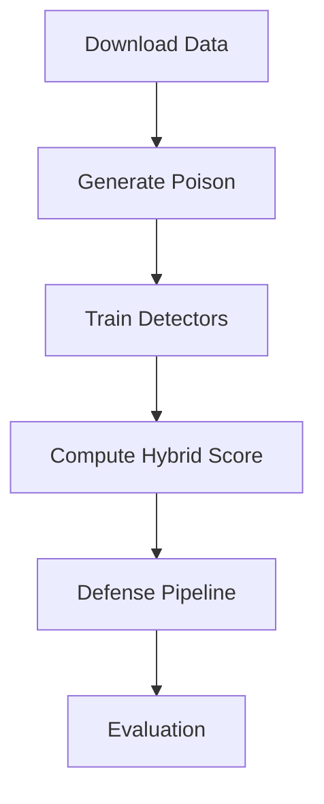

# HADAMT-Lab

HADAMT-Lab (Hybrid Anomaly Detection & Adaptive Model Training) is a stand-alone
laboratory for exploring data poisoning defenses without federated learning. It
combines VAE, GAN, Isolation Forest, LOF and a DIVA-inspired meta-learner for a
hybrid detector.



## Quick Start
```bash
pip install -r requirements.txt
jupyter nbconvert --execute notebooks/0_download.ipynb
jupyter nbconvert --execute notebooks/1_generate_poison.ipynb
jupyter nbconvert --execute notebooks/2_detector_train.ipynb
jupyter nbconvert --execute DefenseTraditionalML/Mal_vs_Hon.ipynb
```

The attacks include label flips and backdoor patches for CIFAR-100 and spike
noise for S&P-500. The hybrid detector aggregates VAE, GAN, IF, LOF and the DIVA
meta-learner. We cite [defense-vae](https://github.com/lxuniverse/defense-vae)
and the Kaggle "Fraud VAE" notebook for architectures.

### VAE Hybrid Detection
`Mal_vs_Hon.ipynb` now trains a convolutional VAE and computes reconstruction
errors for each participant. The errors are combined with existing metrics and
fed into an `IsolationForest` based hybrid detector. The notebook reports KDE
plots for reconstruction errors and hybrid scores together with precision,
recall and ROC-AUC values.
