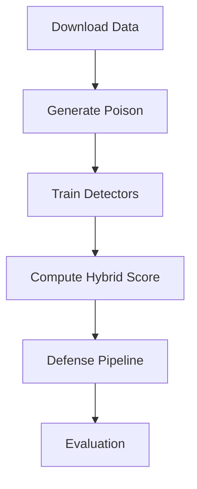

# HADAMT-Lab

HADAMT-Lab (Hybrid Anomaly Detection & Adaptive Model Training) is a stand-alone
laboratory for exploring data poisoning defenses without federated learning. It
combines VAE, GAN, Isolation Forest, LOF and a DIVA-inspired meta-learner for a
hybrid detector.



## Quick Start
The project requires Python 3.8+ together with a number of common machine
learning libraries. Install them into a fresh virtual environment:
```bash
python3 -m venv venv
source venv/bin/activate
pip install torch==2.1.2 torchvision==0.16.2 scikit-learn==1.4.2 \
            pandas==2.2.1 yfinance==0.2.37 numpy==1.26.4 matplotlib==3.8.4 \
            seaborn==0.13.2 tqdm==4.66.4 notebook==7.1.1 loguru==0.7.2
```

Run the included notebooks to launch an attack and then train the hybrid
defense model:
```bash
jupyter nbconvert --execute LaunchingAttacks/poison_mnist_fed.ipynb
jupyter nbconvert --execute DefenseTraditionalML/Mal_vs_Hon.ipynb
```

The attacks include label flips and backdoor patches for CIFAR-100 and spike
noise for S&P-500. The hybrid detector aggregates VAE, GAN, IF, LOF and the DIVA
meta-learner. We cite [defense-vae](https://github.com/lxuniverse/defense-vae)
and the Kaggle "Fraud VAE" notebook for architectures.

### VAE Hybrid Detection
`Mal_vs_Hon.ipynb` now trains a convolutional VAE and computes reconstruction
errors for each participant. The errors are combined with existing metrics and
fed into an `IsolationForest` based hybrid detector. The notebook reports KDE
plots for reconstruction errors and hybrid scores together with precision,
recall and ROC-AUC values.

## Detailed Usage
1. **Clone the repository**
   ```bash
   git clone https://github.com/PanOlifer/hadamt.git
   cd hadamt
   ```
2. **Prepare the environment** using the commands in the Quick Start section
   above. A GPU is optional but speeds up training.
3. **Verify the installation** (optional):
   ```bash
   python LaunchingAttacks/check_libs_ok.py
   ```
   You should see TensorFlow correctly listing available devices.
4. **Run the attack notebook**
   ```bash
   jupyter notebook LaunchingAttacks/poison_mnist_fed.ipynb
   ```
   Execute all cells to generate poisoned MNIST data.
5. **Train the hybrid detector**
   ```bash
   jupyter notebook DefenseTraditionalML/Mal_vs_Hon.ipynb
   ```
   After running all cells you will obtain precision, recall and ROC-AUC
   metrics for detecting malicious clients.
